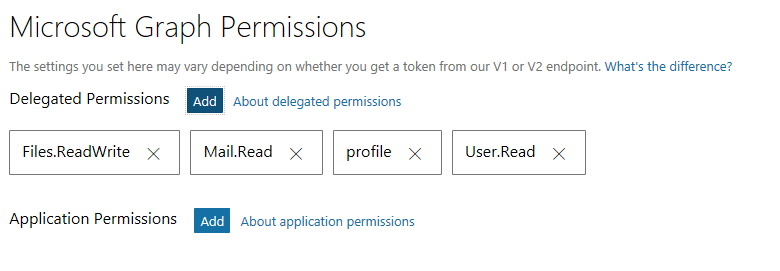

# Updating the add-in to use SSO

## Update the app registration

Because the current version uses Graph to write files to the user's OneDrive, we already have an app registration. We need to update it to meet the requirements of SSO.

### Add Web API details

1. Go to https://apps.dev.microsoft.com and edit the existing app registration.
1. Click **Add Platform**. Choose **Web API**.
1. Under **Application ID URI**, change the default value by inserting your host and port number before the GUID listed there. For example:
    1. Let's say the default value is `api://05adb30e-50fa-4ae2-9cec-eab2cd6095b0`.
    1. Look at the value of **Redirect URLs** under the existing **Web** platform entry. Let's say it is `https://localhost:44349/MessageRead.html`. Copy the `localhost:44349` part.
    1. Insert that into the default **Application ID URI** value after the `//`, then add another `/` after it, so the result is `api://localhost:44349/05adb30e-50fa-4ae2-9cec-eab2cd6095b0`
1. Under **Pre-authorized applications**, enter `d3590ed6-52b3-4102-aeff-aad2292ab01c` for the **Application ID**. Click the **Scope** dropdown and select the only entry there. This preauthorizes Office to access the app.

When you're done, the **Web API** section should look similar to the following:


### Add Microsoft Graph Permissions

1. Locate the **Microsoft Graph Permissions** section in the app registration. Next to **Delegated Permissions**, click **Add**.
1. Select **Files.ReadWrite**, **Mail.Read**, **offline_access**, **openid**, and **profile**. Click **OK**.

When you're done, the **Microsoft Graph Permissions** section should looke like the following:



### Generate an application secret

1. Locate the **Application Secrets** section in the app registration. Click **Generate New Password**.
1. Copy the password that is generated and save it somewhere safe. We'll need this in a bit. Click **OK**.

### Commit changes

Scroll down to the bottom of the app registration and click **Save**.

## Provide user consent to the app

In this step we will provide user consent to the permissions we just configured on the app. This step is **only** necessary because we will be sideloading the add-in for development and testing. Normally a production add-in will be listed in the Office Store, and users will be prompted to give consent during the installation process through the store.

You have two choices for providing consent. You can use an administrator account and consent once for all users in your Office 365 organization, or you can use any account to consent for just that user.

### Provide admin consent for all users

If you have access to a tenant administrator account, this method will allow you to provide consent for all users in your organization, which can be convenient if you have multiple developers that need to develop and test your add-in.

1. Browse to `https://login.microsoftonline.com/common/adminconsent?client_id={application_ID}&state=12345`, where `{application_ID}` is the application ID shown in your app registration.
1. Sign in with your administrator account.
1. Review the permissions and click **Accept**.

The browser will attempt to redirect back to your app, which may not be running. You might see a "this site cannot be reached" error after clicking **Accept**. This is OK, the consent was still recorded.

### Provide consent for a single user

If you don't have access to a tenant administrator account, or you just want to limit consent to a few users, this method will allow you to provide consent for a single user.

1. Browse to `https://login.microsoftonline.com/common/oauth2/authorize?client_id={application_ID}&state=12345&response_type=code`, where `{application_ID}` is the application ID shown in your app registration.
1. Sign in with your account.
1. Review the permissions and click **Accept**.

The browser will attempt to redirect back to your app, which may not be running. You might see a "this site cannot be reached" error after clicking **Accept**. This is OK, the consent was still recorded.

## Update the add-in manifest

The next step is to update the add-in manifest to enable the SSO feature.

1. Open the `./AttachmentDemo/AttachmentDemoManifest/AttachmentDemo.xml` file.
1. Copy the entire `VersionOverrides` element. We are going to use this as the basis for a second `VersionOverrides` element that uses the `VersionOverridesV1_1` schema.
1. Paste the copied data into the manifest just before the closing tag for the existing `VersionOverrides` element.

The following steps all apply to the newly inserted `VersionOverrides` element.

1. In the `VersionOverrides` element, change the following attributes:
    - Change `xmlns` to `http://schemas.microsoft.com/office/mailappversionoverrides/1.1`
    - Change `xsi:type` to `VersionOverridesV1_1`
1. After the `Resources` element, insert the following XML, replacing `YOUR APP ID HERE` with the application ID from your app registration:

    ```xml
    <WebApplicationInfo>
      <Id>YOUR APP ID HERE</Id>
      <Resource>api://localhost:44349/YOUR APP ID HERE</Resource>
      <Scopes>
        <Scope>user.read</Scope>
        <Scope>files.readwrite</Scope>
        <Scope>mail.read</Scope>
      </Scopes>
    </WebApplicationInfo>
    ```

    > **Note**: Make sure that the port number in the `Resource` element matches the port used by your project. It should also match the port you used when registering the application.
1. Save your changes.

Also see this [commit](https://github.com/OfficeDev/outlook-add-in-attachments-demo/commit/318e55e5b613ef1aec9b1a8fbc9335bd1cab6a65) on GitHub for the specific change to the manifest.

> **Note**: At this point, Visual Studio may show a warning or error about the `WebApplicationInfo` element being invalid. The error may not show up until you try to build the solution. As of this writing, Visual Studio has not updated their schema files to include the `WebApplicationInfo` element. To work around this problem, you can use the updated schema file in this repository: [MailAppVersionOverridesV1_1.xsd](manifest-schema-fix/MailAppVersionOverridesV1_1.xsd).
>
> 1. On your development machine, locate the existing MailAppVersionOverridesV1_1.xsd. This should be located in your Visual Studio installation directory under `./Xml/Schemas/{lcid}`. For example, on a typical installation of VS 2017 32-bit on an English (US) system, the full path would be `C:\Program Files (x86)\Microsoft Visual Studio\2017\Enterprise\Xml\Schemas\1033`.
> 1. Rename the existing file to `MailAppVersionOverridesV1_1.old`.
> 1. Move the version of the file from this repository into the folder.

## Update the Web API to handle On-behalf-of flow

Next we need to update the Web API. Currently it is very simple, requiring the add-in to send it both an Outlook token (which it gets from `getCallbackTokenAsync` and a Graph token for OneDrive access (which it gets from OAuth)). We need to update it to accept a bearer token in the `Authorization` header and use that token in the on-behalf-of flow to get an access token.

### Install NuGet packages

1. In Visual Studio, click **Tools**, **NuGet Package Manager**, **Manage NuGet Packages for Solution...**.
1. Click **Browse**, then search for `System.IdentityModel.Tokens.Jwt`.
1. Select select the result, then make sure that the **AttachmentDemoWeb** project is selected. In the **Version** dropdown, select the latest `4.0.*` build and click **Install**.

Repeat those steps (without worrying about specific version) to install these additional packages:

- `Microsoft.Owin`
- `Microsoft.Owin.Security`
- `Microsoft.Owin.Security.Jwt`
- `Microsoft.Owin.Security.OpenIdConnect`
- `Microsoft.Owin.Host.SystemWeb`

Finally, install the Microsoft Authentication Library (MSAL). This is a preview package, so to find it you must select the **Include prerelease** checkbox next to the search box, then search for `Microsoft Identity Client`.

### Configure OWIN middleware

We're going to use OWIN to handle parsing and validating the access token. In order to get that to work, we need to setup the proper OWIN middleware using an OWIN startup class. We'll also add a custom token provider class that can get the signing tokens from the Azure endpoints to perform validation.

#### Add app registration info to web.config

1. Open the `.\AttachmentDemoWeb\Web.config` file. Add the following XML after the first `<configuration>` element:

    ```XML
    <appSettings>
        <add key="ida:AppId" value="YOUR APP ID HERE"/>
        <add key="ida:AppPassword" value="YOUR APP PASSWORD HERE"/>
        <add key="ida:RedirectUri" value="https://localhost:44349"/>
    </appSettings>
    ```
1. Replace `YOUR APP ID HERE` with the application ID from your app registration.
1. Replace `YOUR APP PASSWORD HERE` with the application password from your app registration.
1. If you are using a different port on your local machine, update the port number in the `ida:RedirectUri` value to match.

#### Add the custom token provider

1. In Solution Explorer, right-click the **App_Start** folder and choose **Add**, then **Class...**. Name the class `OpenIdConnectCachingSecurityTokenProvider` and click **Add**.
1. Open the `OpenIdConnectCachingSecurityTokenProvider.cs` file and replace its entire contents with the following code.

    ```csharp
    using Microsoft.IdentityModel.Protocols;
    using Microsoft.Owin.Security.Jwt;
    using System.Collections.Generic;
    using System.IdentityModel.Tokens;
    using System.Threading;

    namespace AttachmentDemoWeb.App_Start
    {
        public class OpenIdConnectCachingSecurityTokenProvider : IIssuerSecurityTokenProvider
        {
            public ConfigurationManager<OpenIdConnectConfiguration> _configManager;
            private string _issuer;
            private IEnumerable<SecurityToken> _tokens;
            private readonly string _metadataEndpoint;

            private readonly ReaderWriterLockSlim _synclock = new ReaderWriterLockSlim();

            public OpenIdConnectCachingSecurityTokenProvider(string metadataEndpoint)
            {
                _metadataEndpoint = metadataEndpoint;
                _configManager = new ConfigurationManager<OpenIdConnectConfiguration>(metadataEndpoint);

                RetrieveMetadata();
            }

            /// <summary>
            /// Gets the issuer the credentials are for.
            /// </summary>
            /// <value>
            /// The issuer the credentials are for.
            /// </value>
            public string Issuer
            {
                get
                {
                    RetrieveMetadata();
                    _synclock.EnterReadLock();
                    try
                    {
                        return _issuer;
                    }
                    finally
                    {
                        _synclock.ExitReadLock();
                    }
                }
            }

            /// <summary>
            /// Gets all known security tokens.
            /// </summary>
            /// <value>
            /// All known security tokens.
            /// </value>
            public IEnumerable<SecurityToken> SecurityTokens
            {
                get
                {
                    RetrieveMetadata();
                    _synclock.EnterReadLock();
                    try
                    {
                        return _tokens;
                    }
                    finally
                    {
                        _synclock.ExitReadLock();
                    }
                }
            }

            private void RetrieveMetadata()
            {
                _synclock.EnterWriteLock();
                try
                {
                    OpenIdConnectConfiguration config = _configManager.GetConfigurationAsync().Result;
                    _issuer = config.Issuer;
                    _tokens = config.SigningTokens;
                }
                finally
                {
                    _synclock.ExitWriteLock();
                }
            }
        }
    }
    ```

#### Add the OWIN startup class

1. In Solution Explorer, right-click the **AttachmentDemoWeb** project and choose **Add**, **New Item...**. Search for `OWIN` and select **OWIN Startup class**. Name the file `Startup.cs` and click **Add**.
1. Open the `Startup.cs` file and replace its entire contents with the following code.

    ```csharp
    using AttachmentDemoWeb.App_Start;
    using Microsoft.Owin;
    using Microsoft.Owin.Security.Jwt;
    using Microsoft.Owin.Security.OAuth;
    using Owin;
    using System.Configuration;
    using System.IdentityModel.Tokens;

    [assembly: OwinStartup(typeof(AttachmentDemoWeb.Startup))]

    namespace AttachmentDemoWeb
    {
        public class Startup
        {
            public void Configuration(IAppBuilder app)
            {
                // For more information on how to configure your application, visit https://go.microsoft.com/fwlink/?LinkID=316888
                var tokenValidationParms = new TokenValidationParameters
                {
                    // Audience MUST be the application ID of the app
                    ConfigurationManager.AppSettings["ida:AppId"],
                    // Since this is multi-tenant we will validate the issuer in the controller
                    ValidateIssuer = false,
                    SaveSigninToken = true
                };

                app.UseOAuthBearerAuthentication(new OAuthBearerAuthenticationOptions
                {
                    AccessTokenFormat = new JwtFormat(tokenValidationParms,
                        new OpenIdConnectCachingSecurityTokenProvider("https://login.microsoftonline.com/common/v2.0/.well-known/openid-configuration"))
                });
            }
        }
    }
    ```

### Modify the SaveAttachmentsController class

The next step is to modify the controller to check for a bearer token. We want to preserve the existing functionality for clients that don't support SSO, so if there is no bearer token, we'll invoke the existing method.

1. Open the `.\AttachmentDemoWeb\Controllers\SaveAttachmentsController.cs` file. Add the following using statements at the top of the file:

    ```csharp
    using System.Linq;
    using System.Security.Claims;
    ```

1. Replace the following line:

    ```csharp
    public async Task<IHttpActionResult> Post([FromBody]SaveAttachmentRequest request)
    ```

    with the following:

    ```csharp
    private async Task<IHttpActionResult> SaveAttachmentsWithDistinctTokens(SaveAttachmentRequest request)
    ```
1. Add the following method to the `SaveAttachmentsController` class:

    ```csharp
    public async Task<IHttpActionResult> Post([FromBody]SaveAttachmentRequest request)
    {
        if (Request.Headers.Contains("Authorization"))
        {
            // Request contains bearer token, validate it
            var scopeClaim = ClaimsPrincipal.Current.FindFirst("http://schemas.microsoft.com/identity/claims/scope");
            if (scopeClaim != null)
            {
                // Check the allowed scopes
                string[] addinScopes = ClaimsPrincipal.Current.FindFirst("http://schemas.microsoft.com/identity/claims/scope").Value.Split(' ');
                if (!addinScopes.Contains("access_as_user"))
                {
                    return BadRequest("The bearer token is missing the required scope.");
                }
            }
            else
            {
                return BadRequest("The bearer token is invalid.");
            }

            var issuerClaim = ClaimsPrincipal.Current.FindFirst("iss");
            var tenantIdClaim = ClaimsPrincipal.Current.FindFirst("http://schemas.microsoft.com/identity/claims/tenantid");
            if (issuerClaim != null && tenantIdClaim != null)
            {
                // validate the issuer
                string expectedIssuer = string.Format("https://login.microsoftonline.com/{0}/v2.0", tenantIdClaim.Value);
                if (string.Compare(issuerClaim.Value, expectedIssuer, StringComparison.OrdinalIgnoreCase) != 0)
                {
                    return BadRequest("The token issuer is invalid.");
                }
            }
            else
            {
                return BadRequest("The bearer token is invalid.");
            }

            // Passed validation, process the request
            return await SaveAttachmentsWithSsoToken(request);
        }
        else
        {
            // No bearer token, so this is a request without SSO
            // Access tokens are included in the request
            return await SaveAttachmentsWithDistinctTokens(request);
        }
    }
    ```

Let's take a look at what we did there. We moved the existing functionality to a private method, and created a new public `Post` method that checks for the bearer token and either calls a method to save with an SSO token or calls the method to use the existing non-SSO method as appropriate. Now we need to implement the `SaveAttachmentsWithSsoToken` method.

1. Add the followin `using` statements to the `.\AttachmentDemoWeb\Controllers\SaveAttachmentsController.cs` file.

    ```csharp
    using Microsoft.Identity.Client;
    using System.Configuration;
    using System.IdentityModel.Tokens;
    ```
1. Add the following method to the `SaveAttachmentsController` class:

    ```csharp
    private async Task<IHttpActionResult> SaveAttachmentsWithSsoToken(SaveAttachmentRequest request)
    {
        // First retrieve the raw access token
        var bootstrapContext = ClaimsPrincipal.Current.Identities.First().BootstrapContext as BootstrapContext;
        if (bootstrapContext != null)
        {
            // Use MSAL to invoke the on-behalf-of flow to exchange token for a Graph token
            UserAssertion userAssertion = new UserAssertion(bootstrapContext.Token);
            ClientCredential clientCred = new ClientCredential(ConfigurationManager.AppSettings["ida:AppPassword"]);
            ConfidentialClientApplication cca = new ConfidentialClientApplication(
                ConfigurationManager.AppSettings["ida:AppId"],
                ConfigurationManager.AppSettings["ida:RedirectUri"],
                clientCred, null, null);

            string[] graphScopes = { "Files.ReadWrite", "Mail.Read" };

            AuthenticationResult authResult = await cca.AcquireTokenOnBehalfOfAsync(graphScopes, userAssertion);

            // Initialize a Graph client
            GraphServiceClient graphClient = new GraphServiceClient(
                new DelegateAuthenticationProvider(
                    (requestMessage) => {
                        // Add the OneDrive access token to each outgoing request
                        requestMessage.Headers.Authorization = new AuthenticationHeaderValue("Bearer", authResult.AccessToken);
                        return Task.FromResult(0);
                    }));

            foreach (string attachmentId in request.attachmentIds)
            {
                var attachment = await graphClient.Me.Messages[request.messageId].Attachments[attachmentId].Request().GetAsync();

                // Is this a file or an Outlook item?
                if (string.Compare(attachment.ODataType, "#microsoft.graph.itemAttachment") == 0)
                {
                    // Re-request the attachment with the item expanded
                    var itemAttachment = await graphClient.Me.Messages[request.messageId].Attachments[attachmentId].Request()
                        .Expand("microsoft.graph.itemAttachment/item").GetAsync() as ItemAttachment;

                    // Serialize the item to JSON and save to OneDrive
                    string jsonItem = JsonConvert.SerializeObject(itemAttachment.Item);
                    MemoryStream fileStream = new MemoryStream();
                    StreamWriter sw = new StreamWriter(fileStream);
                    sw.Write(jsonItem);
                    sw.Flush();
                    fileStream.Position = 0;
                    bool success = await SaveFileToOneDrive(graphClient, itemAttachment.Name + ".json", fileStream);
                    if (!success)
                    {
                        return BadRequest(string.Format("Could not save {0} to OneDrive", itemAttachment.Name));
                    }
                }
                else
                {
                    var fileAttachment = attachment as FileAttachment;

                    // For files, we can build a stream directly from ContentBytes
                    if (fileAttachment.Size < (4 * 1024 * 1024))
                    {
                        MemoryStream fileStream = new MemoryStream(fileAttachment.ContentBytes);
                        bool success = await SaveFileToOneDrive(graphClient, fileAttachment.Name, fileStream);
                        if (!success)
                        {
                            return BadRequest(string.Format("Could not save {0} to OneDrive", fileAttachment.Name));
                        }
                    }
                    else
                    {
                        // TODO: Add code here to handle larger files. See:
                        // https://developer.microsoft.com/en-us/graph/docs/api-reference/v1.0/api/item_createuploadsession
                        // and
                        // https://github.com/microsoftgraph/aspnet-snippets-sample/blob/master/Graph-ASPNET-46-Snippets/Microsoft%20Graph%20ASPNET%20Snippets/Models/FilesService.cs
                        return BadRequest("File is too large for simple upload.");
                    }
                }
            }

            return Ok();
        }
        else
        {
            return BadRequest("Could not retrieve access token from request.");
        }
    }
    ```

### Update the add-in JavaScript to use SSO

The only remaining task is to update the add-in JavaScript to get the SSO token and use it to call the Web API.

#### Update the taskpane code

1. Open the `.\AttachmentDemoWeb\MessageRead.js` file. Rename the existing `saveAttachments` method to `saveAttachmentsWithPrompt`. Remove the call to `showSpinner` at the beginning of the method.
1. Add the following code into the file:

    ```js
    function saveAttachments(attachmentIds) {
        showSpinner();

        // First attempt to get an SSO token
        if (Office.context.auth !== undefined && Office.context.auth.getAccessTokenAsync !== undefined) {
            Office.context.auth.getAccessTokenAsync(function (result) {
                if (result.status === "succeeded") {
                    // No need to prompt user, use this token to call Web API
                    saveAttachmentsWithSSO(result.value, attachmentIds);
                } else {
                    // Could not get SSO token, proceed with authentication prompt
                    saveAttachmentsWithPrompt(attachmentIds);
                }
            });
        }
    }

    function saveAttachmentsWithSSO(accessToken, attachmentIds) {
        var saveAttachmentsRequest = {
            attachmentIds: attachmentIds,
            messageId: getRestId(Office.context.mailbox.item.itemId)
        };

        $.ajax({
            type: "POST",
            url: "/api/SaveAttachments",
            headers: {
                "Authorization": "Bearer " + accessToken
            },
            data: JSON.stringify(saveAttachmentsRequest),
            contentType: "application/json; charset=utf-8"
        }).done(function (data) {
            showNotification("Success", "Attachments saved");
        }).fail(function (error) {
            showNotification("Error saving attachments", error.status);
        }).always(function () {
            hideSpinner();
        });
    }
    ```

#### Update the UI-less code

1. Open the `.\AttachmentDemoWeb\Functions\FunctionFile.js` file. Rename the existing `saveAllAttachments` method to `saveAllAttachmentsWithPrompt`.
1. Add the following code to the file:

    ```js
    function saveAllAttachments(event) {
        showProgress("Try to obtain SSO token");

        // First attempt to get an SSO token
        if (Office.context.auth !== undefined && Office.context.auth.getAccessTokenAsync !== undefined) {
            Office.context.auth.getAccessTokenAsync(function (result) {
                if (result.status === "succeeded") {
                    // No need to prompt user, use this token to call Web API
                    saveAllAttachmentsWithSSO(result.value, event);
                } else {
                    // Could not get SSO token, proceed with authentication prompt
                    saveAllAttachmentsWithPrompt(event);
                }
            });
        }
    }

    function saveAllAttachmentsWithSSO(ssoToken, event) {
        var attachmentIds = [];

        Office.context.mailbox.item.attachments.forEach(function (attachment) {
            attachmentIds.push(getRestId(attachment.id));
        });

        var saveAttachmentsRequest = {
            attachmentIds: attachmentIds,
            messageId: getRestId(Office.context.mailbox.item.itemId)
        };

        $.ajax({
            type: "POST",
            url: "/api/SaveAttachments",
            headers: {
                "Authorization": "Bearer " + ssoToken
            },
            data: JSON.stringify(saveAttachmentsRequest),
            contentType: "application/json; charset=utf-8"
        }).done(function (data) {
            showSuccess("Attachments saved");
        }).fail(function (error) {
            showError("Error saving attachments");
        }).always(function () {
            event.completed();
        });
    }
    ```